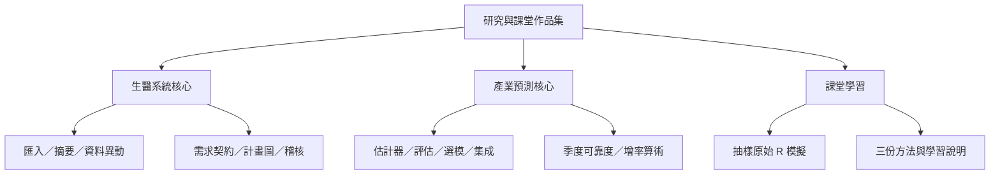

# 架構與資料邊界

兩個研究子專案各自可以執行，不共用私人輸入或服務；課堂作品另行呈現。

公開邊界採明確檔案清單：複製可獨立閱讀的核心原碼，抽出依賴少且無資料 I/O 的原函式，再加入合成輸入及文件。原檔 SHA、抽出行數與修改理由見根目錄 PROVENANCE.json。真實資料、模型、部署、伺服器、機密設定及第三方 vendor 不在邊界內。

Python 示範不使用網路。生醫資料檢視程式本身會依呼叫者提供的輸出位置產生快照；其原測試使用臨時目錄。產業示範只在記憶體生成數值。R 增率示範也是記憶體合成序列；抽樣完整程式會在當前課程目錄產出 output/，預設不進版本控制。
