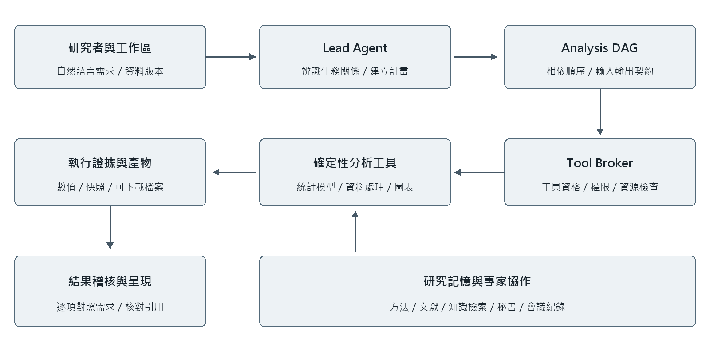
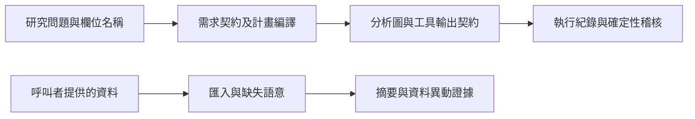

# 生醫研究資料與分析計畫核心

研究背景是把自然語言研究需求轉成可追溯的分析流程：先確定 outcome、exposure、covariates、篩選條件與輸出，再檢查分析計畫與實際執行是否一致。同時需要看得出資料在匯入、篩選及工具之間的變化。這些問題與生物統計中的分析假設、缺失資料處理及可重現性直接相關。

這裡公開的是 BLADE-M Research Room 專案截至 2026-09-22 的確定性核心，12 個模組保留原檔內容；package 初始化只保留這些模組的原有匯出。本人負責方法實作、流程整合、結果檢查與文件化；原有套件、合作內容及第三方方法依來源標示。



## 目錄與架構

| 核心 | 來源模組 | 用途 |
|---|---|---|
| 資料匯入與型別 | [dataset_import.py](research_room/dataset_import.py) | 保留文字 ID、區分空白與字面 NA/nan；輸入由呼叫者提供。 |
| 資料異動證據 | [data_inspection.py](research_room/data_inspection.py) | 依保留 index 比對資料列、欄位型別與變更；建立快照、hash 及有限預覽。 |
| 資料摘要 | [dataset_summary.py](research_room/dataset_summary.py) | 欄位型態、缺失、描述摘要及 HTML；未附真實資料字典。 |
| 篩選語意 | [filtering.py](research_room/filtering.py) | 缺失值標記、篩選運算子與條件正規化。 |
| 契約與需求 | [contracts.py](research_room/contracts.py)、[user_requirements.py](research_room/user_requirements.py) | 不可任意改寫的需求、語意 hash、角色／方法及執行綁定。 |
| 分析計畫 | [lead_compiler.py](research_room/lead_compiler.py)、[reconciliation.py](research_room/reconciliation.py) | 明確文字事實、計畫圖、能力適配、輸出及欄位一致性。 |
| 工具與稽核 | [tool_registry.py](research_room/tool_registry.py)、[audit.py](research_room/audit.py) | 工具 manifest、輸入輸出 schema、執行證據與需求核對。 |
| 輔助語意 | [resource_intent.py](research_room/resource_intent.py)、[clarification_memory.py](research_room/clarification_memory.py) | 外部資源意圖、澄清需求與恢復文本。 |



工具 registry 會描述完整應用中的統計能力；本子集沒有那些工具的執行器。registry 內的歷史 verification 標記不表示本公開版本完成了每種統計分析或模型的端到端驗證。

## 執行

先依 repository 根目錄安裝 requirements，然後在本目錄執行：

```sh
python -B run_demo.py
python -B run_plan_demo.py
python -B -m unittest discover -s tests -v
```

`run_demo.py` 使用明確標示的四列合成 CSV，檢查 4 列變 2 列、`0003/0004` 的文字 ID、字面 NA/nan、平均 BMI=35 及保留值未被改寫。`run_plan_demo.py` 只展示合成研究問題的契約與分析計畫，不執行臨床分析。

原測試包含 49 項契約／計畫測試及 9 項資料檢視獨立測試，覆蓋需求 hash、角色保留、明確候選特徵、輸出綁定、工具參數被更改的稽核、列識別、缺失語意、變更預覽上限、輸入遭變更與失敗回條。這些是軟體行為證據，不能推導診斷正確率或臨床有效性。

## 邊界與限制

- 沒有 LLM API、伺服器、資料庫、真實健康／基因體資料、帳密或部署設定。
- 快照與差異預覽的程式有能力寫出呼叫者提供的資料；真實部署仍需由完整應用實作存取控制。`public()` 的精簡欄位不是完整權限系統。
- 這個確定性核心不做自然語言的全面理解，也不替代研究者確認混雜、選擇偏差、可識別性與統計模型。
- 完整研究敘述與成果文件見 [Drive 研究專題](https://drive.google.com/drive/folders/1XyPpjNNa1_XnkvsAOfRAHnjBfKDWGdp4)。
