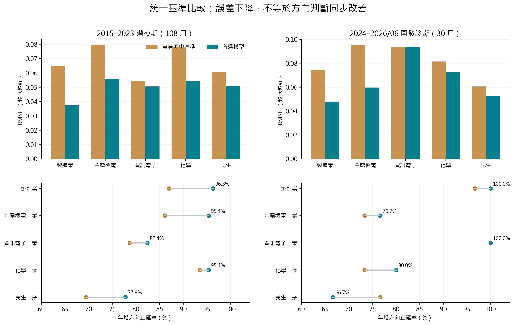

# 產業預測與可靠度方法

這項研究探討五大產業的時間序列預測、歷史績效評估，以及外部變數訊號何時應收縮。公開內容取自實際研究程式，包含完整估計器模組與可獨立呼叫的評估、集成、季度可靠度及增率計算。私人工作表、逐月真實值、實際預測序列及已訓練模型都沒有附入。

本人負責方法實作、模型比較、流程整合、結果檢查與文件化；原有套件、合作內容及第三方方法依來源標示。



## 真實程式與新增封裝

| 檔案 | 來源與功能 |
|---|---|
| [scoped_industry_estimators.py](scoped_industry_estimators.py) | 原始同名模組，23 個模型名稱與調參網格、fit/predict、特徵 metadata、同一已擬合模型的貢獻分解與集成。只移除本機 vendor 搜尋注入，演算法不變。 |
| [evaluation.py](evaluation.py) | 原 `run_scoped_industry_forecast.py` 的 `ensemble_weights`、`metric`、`select` 及依賴常數，定義內容原樣抽出。 |
| [季度可靠度運算器](R/single_factor_reliability_operator.R) | 原 `36_E3_common_factor_reliability_operator.R` 的完整純函式。 |
| [月／季／年增率計算](R/growth_tables.R) | 2026-09-22 原增率 R 檔的五產業常數及 `.growth_*`、`calculate_growth_tables`；不帶來源檔搜尋與真實輸入。 |
| [合成示例](run_demo.py)、[Python 測試](tests/test_estimators.py)、[R 檢查](R/run_synthetic_checks.R) | 這次公開整理新加的驅動與測試；呼叫上述真實函式，不替代原研究。 |

## 方法

估計器包含 AR/Fourier Ridge、Ridge、Elastic Net、Sparse Group LASSO、Bayesian Ridge、PLS、SVR、樹模型、AdaLASSO 變體、中央基準＋受限外部訊號、Spline、兩階段方向／幅度與分位數 Gradient Boosting。XGBoost、LightGBM、CatBoost 使用正常安裝的可選套件；未將套件 vendor 複製進 repository。

估計器的呼叫者必須先處理當時可得資訊、產業群組限制、轉換、缺失值及訓練期標準化；`fit_model` 本身不會替呼叫者消除資料洩漏。`AdaLASSO_Reliability_Strict` 的完整觀測篩選也由呼叫者負責。此處的可靠度權重取自訓練殘差收縮，不是 out-of-fold 成功率。

評估在 log-growth 尺度計算誤差，同時檢查方向、動能與轉折。轉折使用上一期**已觀察動能**作基準；`select` 只使用 2015–2023 的 108 個月，按 RMSLE、年增方向、動能、Turn F1、路徑相關與校準斜率組合排序。2024–2026 的近期表不決定該函式選模。動態集成根據過去最多 8 次已觀察預測誤差調整權重；傳入的歷史若包含未來值，函式不會自行辨認。

季度運算器對「完整預測／移除某訊號的預測」的 log 差異計算訊號，使用過去有效季度更新可靠度及上限，並把修正反映到同一預測。它不證明因子具有因果效應。季增與全年增率則先加總未四捨五入月產值，再計算比值，不平均各月增率。

## 安裝與執行

根目錄 requirements 安裝後，在本目錄執行：

```sh
python -B run_demo.py
python -B -m unittest discover -s tests -v
Rscript R/run_synthetic_checks.R
```

可選模型另行安裝 `xgboost lightgbm catboost`。目前驗證涵蓋 20 個標準依賴模型，未執行這三種可選模型，不把它們列為已驗證。

Windows 的 R 若顯示 inherited `C.UTF-8` 不支援或中文解析錯誤，可使用：

```sh
Rscript -e "Sys.setlocale('LC_CTYPE','English_United States.utf8'); source('R/run_synthetic_checks.R', encoding='UTF-8')"
```

R 增率函式是計算核心，預期輸入依五產業與月份排序，每業 2025-01 至 2027-12 的 36 列，合計 180 列，欄位 `industry, month, value, status, model, as_of, source_cell, source_file, unit, vintage`。前 18 月標為實際值、後 18 月為預測值。合成例在記憶體產生此結構，以假值和假來源欄位驗證 120 月／40 季／10 年輸出。原真實資料讀取器的完整輸入驗證沒有抽出，呼叫者須自行確認序列完整性與正數分母。

## 重現範圍及限制

- 原始專案工作表是最終版本快照，不是逐期發布資料庫；原研究的時間序列驗證應解讀為給定快照與資訊假設下的條件式評估。
- 此處不帶原資料前處理與全部 runner；可以重現核心行為、方法算術與合成測試，不能重算原實證成績。
- 模型績效與可靠度不是經濟因果效果，也不保證未來外推表現。新 synthetic demo 只做程式檢查。
- 文件與報告見 [Drive 研究專題](https://drive.google.com/drive/folders/1XyPpjNNa1_XnkvsAOfRAHnjBfKDWGdp4)。
